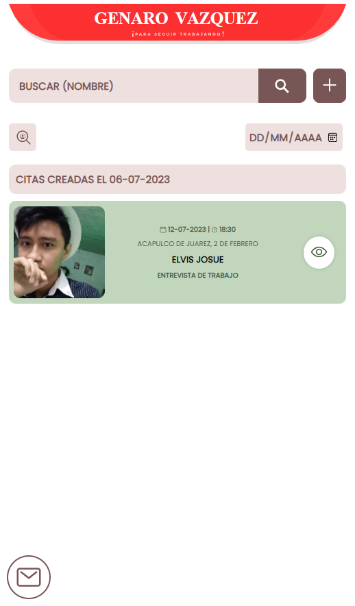
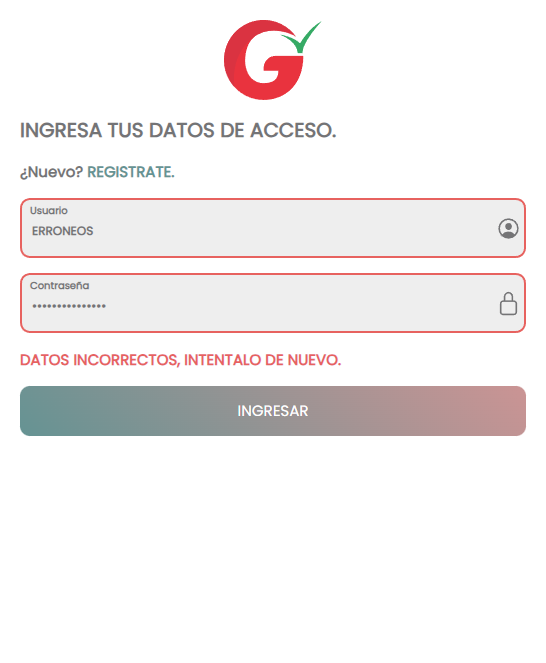
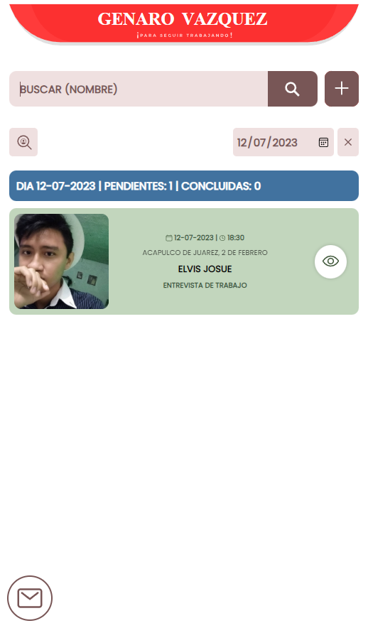
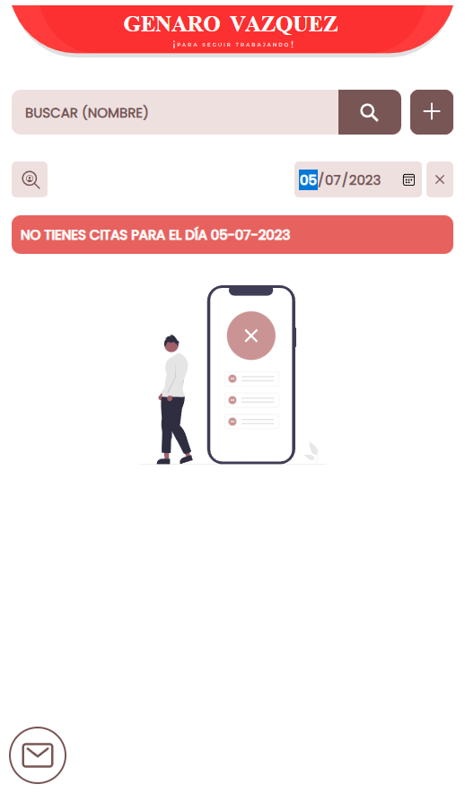
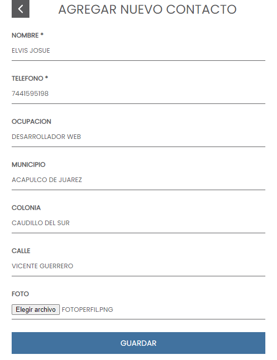
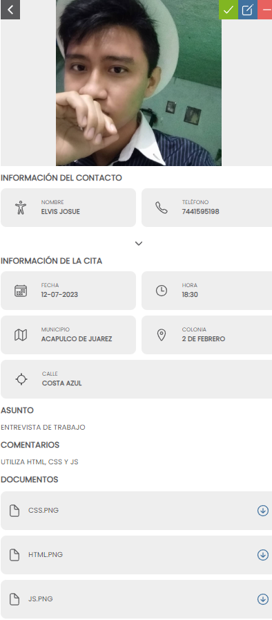
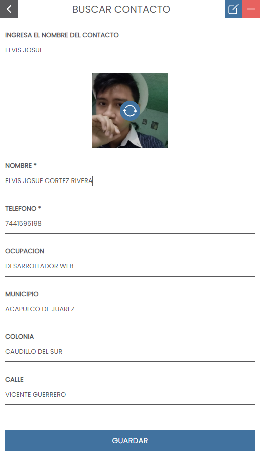
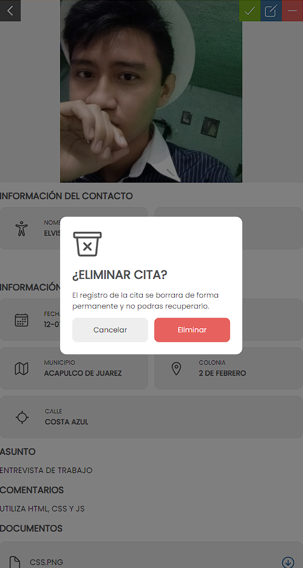
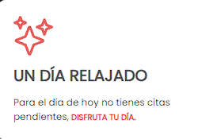
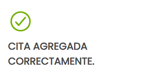

# Regiduria | Aplicación web         

### 📝 Descripción breve
  Esta es una aplicación web que <b>ADMINISTRA</b> citas y contactos. Las funciones principales de la aplicación son:  
 
* 🔐 Inicio de Sesión,
* 🧑‍💻 Registro de Administradores (🔑 Se necesita un token de acceso, el cúal se le proporciono al personal autorizado),
* ⚠️ Validación de campos,
* 🔎 Busqueda de Registros (Citas, Contactos),
* ✅ Agregar Registros (Citas, Contactos),
* 📖 Leer Información (Citas, Contactos),
* 🔄 Actualizar Información (Citas, Contactos),
* ❌ Eliminar Registros (Citas, Contactos)

##

### 🔐 Inicio de Sesión y ⚠️ Validación de campos (Ejemplo: Datos Incorrectos)
La siguiente imagen muestra la interfaz de <b>INICIAR SESION</b> y, a su vez, nos muestra la <b><i>VALIDACION</i></b> de los campos. 
   

##
### 🔎 Busqueda de Registros (Ejemplo: Por Fecha)
La siguiente imagen muestra la interfaz de una <b>BUSQUEDA EXITOSA.</b>
   

   
La siguiente imagen muestra la interfaz de una <b>BUSQUEDA SIN EXITO.</b>
   

   
<i><b>Nota:</b> También se puede realizar la búsqueda a través del nombre del contacto.</i>
##
### ✅ Agregar Registro (Ejemplo: Contacto)
La siguiente imagen muestra la interfaz de <b>AGREGAR CONTACTO.</b>
   

##
### 📖 Leer Registro (Ejemplo: Cita)
La siguiente imagen muestra la interfaz de <b>LEER/VISUALIZAR CITA.</b>
   

##
### 🔄 Actualizar Registro (Ejemplo: Contacto)
La siguiente imagen muestra la interfaz de <b>ACTUALIZAR CONTACTO.</b>
   

##
### ❌ Eliminar Registro (Ejemplo: Cita)
La siguiente imagen muestra la interfaz de <b>ELIMINAR CITA.</b>
   

##
### 🗨️ Sistema de Alertas (Ejemplos)
La siguiente imagen muestra la alerta que muestra un mensaje de acuerdo a la <b>CANTIDAD DE CITAS</b> programadas para ese día. (En este caso, un día sin citas)
   

   
La siguiente imagen muestra la alerta al realizar una <b>ACCION EXITOSA.</b> (En este caso, un registro exitoso)
   

##
